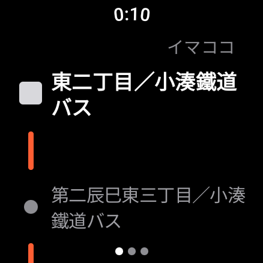
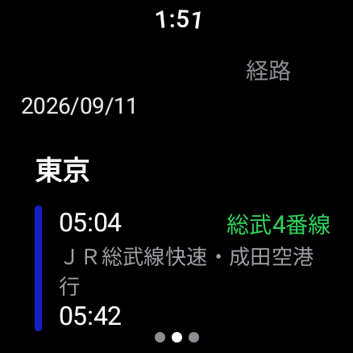
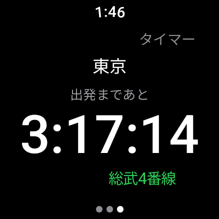
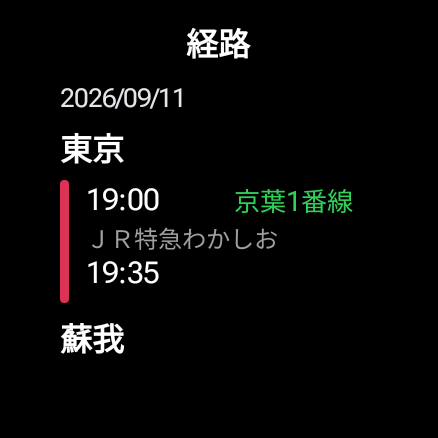
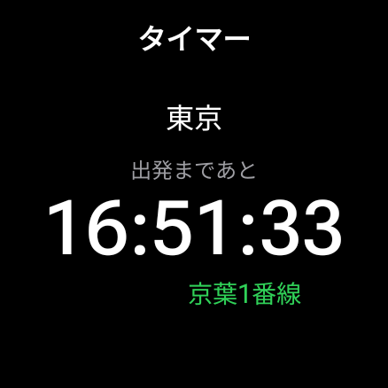
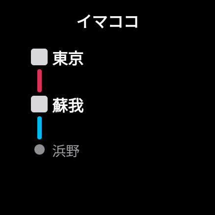

# Ekispert Wear

駅すぱあと for Android で検索した経路を Galaxy Watch などの Wear OS で見るためのアプリです。公式の Wear OS 版が終了したので、Apple Watch 版の画面構成（イマココ / 経路 / タイマー）を Wear OS で再現しました。

公式アプリ本体には [Morphe](https://github.com/MorpheApp) のパッチを当てて情報を取り出します。パッチは別リポジトリ [ekispert-morphe-patches](https://github.com/Sfehhrths/ekispert-morphe-patches) にあります。

> 個人利用を前提にしています。改変した駅すぱあとの APK は再配布しないでください。

## 画面

| イマココ | 経路 | タイマー |
|---|---|---|
|  |  |  |

- **イマココ**: 停車駅の一覧。乗降駅は四角、途中駅は丸。時刻表どおりに走っている前提で、停車中の駅を帯で、駅間なら線の途中に ▼ で現在位置を示します。
- **経路**: 日付、駅名、区間ごとの発着時刻・路線名・番線。
- **タイマー**: 次に乗る列車の出発までのカウントダウンと番線。乗る列車が無くなれば到着までの残り時間。

タイルも 3 種類あります（タイルの見た目は端末の他タイルに合わせています）。

| 経路 | タイマー | イマココ |
|---|---|---|
|  |  |  |

## 仕組み

```
駅すぱあと(パッチ済) ─Broadcast(gzip)─▶ companion(スマホ) ─Wearable Data Layer─▶ wear(ウォッチ)
```

1. パッチ済みの駅すぱあとが、経路検索の応答 XML と「どの経路を開いたか」を Broadcast で送ります。
2. スマホ側の `companion` が受け取り、XML を解析して「最後に触った経路」を決め、Data Layer の `/ekispert/course` に JSON で書き込みます。対象になるのは、詳細画面で開いた（スワイプした）経路、My クリップから開いた経路、乗換アラームに登録した経路です。
3. ウォッチ側の `wear` が受け取って表示します。起動時にも Data Layer から最新を取り直します。

| モジュール | 種類 | 役割 |
|---|---|---|
| `shared` | Kotlin JVM | 共通モデル（`CoursePayload`、`Course`、`Line`、`Stop`）と Data Layer の定数 |
| `companion` | Android（スマホ） | Broadcast 受信、XML 解析、Data Layer 送信、状態表示 |
| `wear` | Android（Wear OS） | 3 ページの UI、3 種のタイル |

Broadcast の送信元は UID で検証しており、駅すぱあと以外からの送信は捨てます。

## 必要なもの

- 駅すぱあと for Android 3.53.0 に [ekispert-morphe-patches](https://github.com/Sfehhrths/ekispert-morphe-patches) を当てたもの
- Android 14 以降のスマホ（送信元の検証に `BroadcastReceiver.getSentFromUid()` を使うため）
- Wear OS 3 以降（API 30+）のウォッチ。Galaxy Watch（API 37）で確認
- JDK 21、Android SDK（compileSdk 36）

## ビルドとインストール

```bash
cp keystore.properties.example keystore.properties   # 署名鍵の設定（後述）
./gradlew :companion:assembleDebug :wear:assembleDebug
adb -s <スマホ> install -r companion/build/outputs/apk/debug/companion-debug.apk
adb -s <ウォッチ> install -r wear/build/outputs/apk/debug/wear-debug.apk
```

- コンパニオンはインストール後に **一度起動**してください（起動していないアプリには Broadcast が届きません）。
- スマホとウォッチのアプリは **同じ applicationId・同じ署名鍵**である必要があります（Data Layer の制約）。`keystore.properties` に鍵を指定すると debug/release とも同じ鍵で署名します。

`keystore.properties` の例:

```properties
storeFile=../path/to/your.keystore
storePassword=...
keyAlias=...
keyPassword=...
```

バージョンは Gradle プロパティで上書きできます（CI が使います）。

```bash
./gradlew :companion:assembleRelease :wear:assembleRelease -PappVersionName=1.2.3 -PappVersionCode=45
```

ウォッチへの adb 接続は「設定 → 開発者向けオプション → ワイヤレスデバッグ」でペアリングします。

```bash
adb pair <IP>:<ペアリングポート> <コード>
adb connect <IP>:<接続ポート>
```

## 使い方

1. スマホの駅すぱあとで経路を検索し、経路を開きます。
2. ウォッチのアプリ（またはタイル）に、その経路が出ます。詳細画面でスワイプすると追従します。
3. 乗換アラームに登録した経路や My クリップから開いた経路も同様に送られます。「最後に触った経路」が表示対象です。

ログ:

```bash
adb -s <スマホ> logcat -s EkispertWear
adb -s <ウォッチ> logcat -s EkispertWear
```

## リリース（GitHub Actions）

`.github/workflows/build.yml` が push ごとに release ビルドを行い、`v1.2.3` 形式のタグを push したときだけ GitHub Release を作って `companion-1.2.3.apk` と `wear-1.2.3.apk` を添付します。`versionName` はタグから、`versionCode` は Actions の実行番号から入ります。

署名鍵はリポジトリに含めず、Secrets から復元します。リポジトリの Settings → Secrets and variables → Actions に次を登録してください。

| Secret | 内容 |
|---|---|
| `KEYSTORE_BASE64` | keystore ファイルを base64 にしたもの |
| `KEYSTORE_PASSWORD` | keystore のパスワード |
| `KEY_ALIAS` | 鍵のエイリアス |
| `KEY_PASSWORD` | 鍵のパスワード |

base64 の作り方（PowerShell）:

```powershell
[Convert]::ToBase64String([IO.File]::ReadAllBytes("path\to\your.keystore")) | Set-Clipboard
```

Secrets が無い場合（フォークや PR）はデバッグ鍵で署名されます。その APK は手元の鍵で署名したものとは署名が違うため、入れ替えるときは一度アンインストールが必要です。

リリース手順:

```bash
git tag v1.2.3
git push origin v1.2.3
```

## 制限・未対応

- 遅延・運行情報は取り込んでいますが、まだ画面には出していません。
- 前のダイヤ／次のダイヤの操作はありません。
- イマココの現在位置は時刻表からの推定です（リアルタイム位置ではありません）。

## ライセンス

[MIT](LICENSE)
